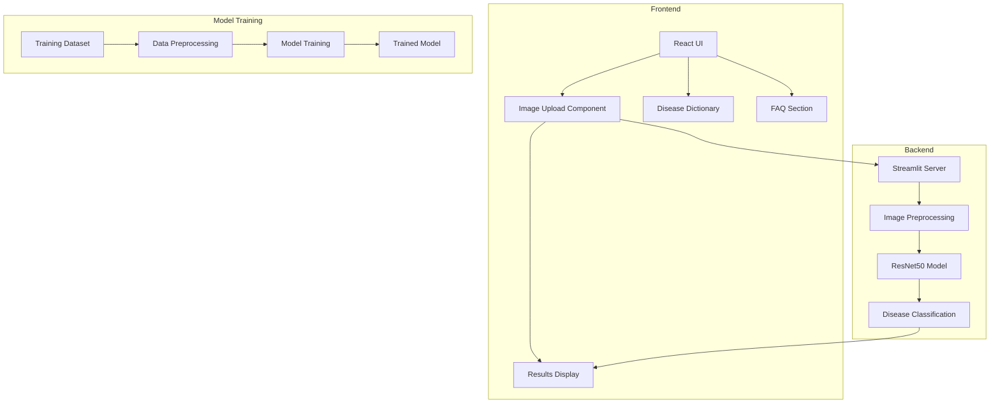
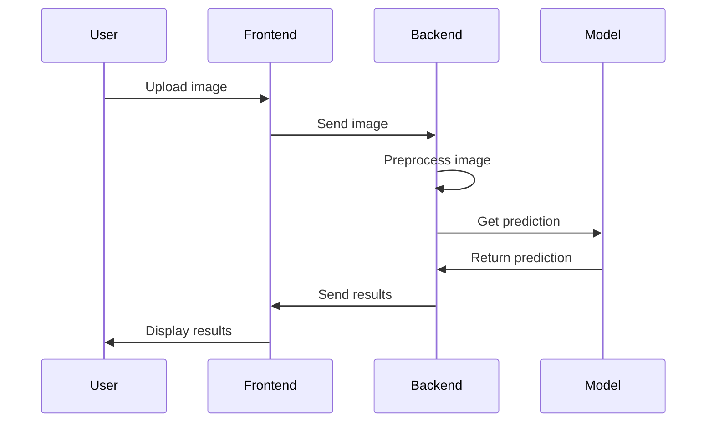

# AI-Powered Skin Disease Detection System Documentation

## Table of Contents
1. [Project Overview](#project-overview)
2. [System Architecture](#system-architecture)
3. [Technical Stack](#technical-stack)
4. [Methodology](#methodology)
5. [Code Workflow](#code-workflow)
6. [Project Structure](#project-structure)
7. [Implementation Details](#implementation-details)

## Project Overview

This project implements an AI-powered skin disease detection system with both a Python backend (using Streamlit) and a React frontend. The system is designed to identify various skin conditions from uploaded images using deep learning technology.

## System Architecture



## Technical Stack

1. **Backend**
   - Python 3.x
   - Streamlit
   - TensorFlow/Keras
   - OpenCV
   - NumPy

2. **Frontend**
   - React.js
   - Vite
   - CSS3
   - ES6+ JavaScript

3. **Model**
   - Architecture: ResNet50
   - Framework: TensorFlow/Keras
   - Input Size: 224x224 pixels
   - Output: 8 disease classes

## Methodology

### 1. Data Collection and Preparation
- Dataset organization in train_set and test_set
- Disease categories:
  - Bacterial Infections (Cellulitis, Impetigo)
  - Fungal Infections (Athlete's foot, Nail fungus, Ringworm)
  - Parasitic Infections (Cutaneous larva migrans)
  - Viral Infections (Chickenpox, Shingles)

### 2. Model Development
1. **Preprocessing Pipeline**
   - Image resizing to 224x224
   - Normalization using ResNet50 preprocessing
   - Data augmentation techniques

2. **Model Architecture**
   - Base: ResNet50 with pre-trained weights
   - Custom classification head
   - Softmax activation for multi-class classification

### 3. Implementation Workflow
1. **Backend Development**
   - Streamlit web application setup
   - Image processing pipeline
   - Model integration
   - Result generation and formatting

2. **Frontend Development**
   - React components hierarchy
   - User interface design
   - Image upload functionality
   - Results display
   - Educational content integration

## Code Workflow



## Project Structure

```
project/
├── app.py                 # Main Streamlit application
├── label_map.json        # Disease label mapping
├── my_model.h5          # Trained model
├── AI-dermatologist/    # React frontend
│   ├── src/
│   │   ├── components/  # React components
│   │   ├── pages/      # Page components
│   │   └── assets/     # Static assets
│   └── public/         # Public assets
└── skin-disease-dataset/
    ├── train_set/      # Training data
    └── test_set/       # Testing data
```

## Implementation Details

### Backend (app.py)

1. **Initialization**
   - Model loading
   - Label map configuration
   - Streamlit UI setup

2. **Image Processing**
   ```python
   # Image preprocessing pipeline
   resized_img = cv2.resize(img, (224, 224))
   input_img = np.expand_dims(resized_img, axis=0)
   input_img = preprocess_input(input_img)
   ```

3. **Prediction Pipeline**
   ```python
   # Disease prediction
   predictions = model.predict(input_img)
   predicted_index = np.argmax(predictions)
   confidence = float(np.max(predictions))
   ```

### Frontend

1. **Component Structure**
   - Navbar
   - Photo Upload
   - Results Display
   - Disease Dictionary
   - FAQ Section
   - Footer

2. **Key Features**
   - Responsive design
   - Interactive UI
   - Educational content
   - User guidance
   - Multilingual support

### Performance Considerations

1. **Model Optimization**
   - Batch prediction support
   - Memory efficiency
   - Inference speed optimization

2. **Application Performance**
   - Image compression
   - Lazy loading
   - Responsive design
   - Error handling

This documentation provides a comprehensive overview of the project's architecture, methodology, and implementation details. The system is designed to be scalable, maintainable, and user-friendly while providing accurate skin disease detection capabilities.