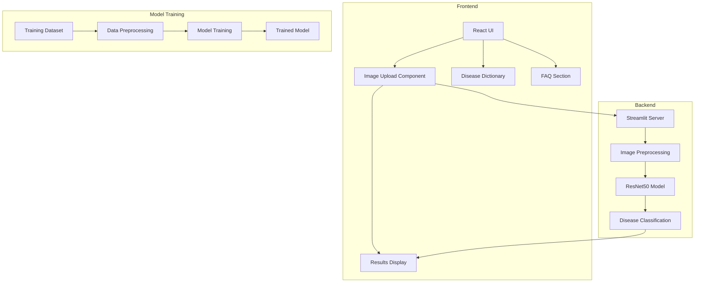
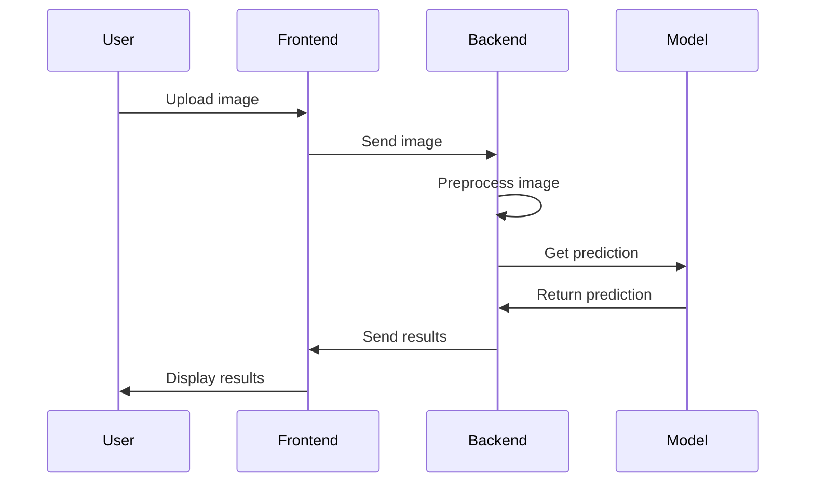

# AI-Powered Skin Disease Detection System Documentation

## Table of Contents
1. [Project Overview](#project-overview)
2. [System Architecture](#system-architecture)
3. [Technical Stack](#technical-stack)
4. [Methodology](#methodology)
5. [Code Workflow](#code-workflow)
6. [Project Structure](#project-structure)
7. [Implementation Details](#implementation-details)

## Project Overview

This project implements an AI-powered skin disease detection system with both a Python backend (using Streamlit) and a React frontend. The system is designed to identify various skin conditions from uploaded images using deep learning technology.

## System Architecture



## Technical Stack

1. **Backend**
   - Python 3.x
   - Streamlit
   - TensorFlow/Keras
   - OpenCV
   - NumPy

2. **Frontend**
   - React.js
   - Vite
   - CSS3
   - ES6+ JavaScript

3. **Model**
   - Architecture: ResNet50
   - Framework: TensorFlow/Keras
   - Input Size: 224x224 pixels
   - Output: 8 disease classes

## Methodology

### 1. Data Collection and Preparation
- Dataset organization in train_set and test_set
- Disease categories:
  - Bacterial Infections (Cellulitis, Impetigo)
  - Fungal Infections (Athlete's foot, Nail fungus, Ringworm)
  - Parasitic Infections (Cutaneous larva migrans)
  - Viral Infections (Chickenpox, Shingles)

### 2. Model Development
1. **Preprocessing Pipeline**
   - Image resizing to 224x224
   - Normalization using ResNet50 preprocessing
   - Data augmentation techniques

2. **Deep Learning Model Architecture**

   a. **Base Model: ResNet50 Architecture**

   ```mermaid
   graph TD
    subgraph ResNet50
        Input[Input 224x224x3] --> Conv1
        
        subgraph Conv1
            Conv1 --> |"7x7 conv, 64"| C1
            C1 --> |"stride=2"| BN1[BatchNorm]
            BN1 --> ReLU1[ReLU]
            ReLU1 --> MP[MaxPool 3x3]
        end
        
        subgraph Stage1[Stage 1 - Conv2_x]
            MP --> |"× 3 blocks"| B1[Bottleneck Block]
            B1 --> |"64-64-256"| B1Out
        end
        
        subgraph Stage2[Stage 2 - Conv3_x]
            B1Out --> |"× 4 blocks"| B2[Bottleneck Block]
            B2 --> |"128-128-512"| B2Out
        end
        
        subgraph Stage3[Stage 3 - Conv4_x]
            B2Out --> |"× 6 blocks"| B3[Bottleneck Block]
            B3 --> |"256-256-1024"| B3Out
        end
        
        subgraph Stage4[Stage 4 - Conv5_x]
            B3Out --> |"× 3 blocks"| B4[Bottleneck Block]
            B4 --> |"512-512-2048"| B4Out
        end
        
        B4Out --> AP[Average Pooling]
        AP --> FC[Dense 8]
        FC --> Output[Softmax]
    end

    subgraph BottleneckBlock[Bottleneck Block Structure]
        BB_In[Input] --> Conv1x1_1[1x1 Conv]
        Conv1x1_1 --> BN1_BB[BatchNorm]
        BN1_BB --> ReLU1_BB[ReLU]
        ReLU1_BB --> Conv3x3[3x3 Conv]
        Conv3x3 --> BN2_BB[BatchNorm]
        BN2_BB --> ReLU2_BB[ReLU]
        ReLU2_BB --> Conv1x1_2[1x1 Conv]
        Conv1x1_2 --> BN3_BB[BatchNorm]
        BB_In --> |"Identity Shortcut"| Add((+))
        BN3_BB --> Add
        Add --> ReLU3_BB[ReLU]
    end
   ```

   ```
   ResNet50 Architecture:
   
   Input Layer [224×224×3]
   └── Conv1
       ├── Conv2D [7×7, 64 filters, stride=2]
       ├── BatchNorm
       ├── ReLU
       └── MaxPool [3×3, stride=2]
           └── Conv2_x (3 bottleneck blocks)
               ├── [1×1, 64]
               ├── [3×3, 64]
               └── [1×1, 256]
                   └── Conv3_x (4 bottleneck blocks)
                       ├── [1×1, 128]
                       ├── [3×3, 128]
                       └── [1×1, 512]
                           └── Conv4_x (6 bottleneck blocks)
                               ├── [1×1, 256]
                               ├── [3×3, 256]
                               └── [1×1, 1024]
                                   └── Conv5_x (3 bottleneck blocks)
                                       ├── [1×1, 512]
                                       ├── [3×3, 512]
                                       └── [1×1, 2048]
                                           └── Average Pooling
                                               └── FC [8 classes]
   ```

   **Layer Details:**
   1. **Initial Layers**
      - Input: 224×224×3 RGB image
      - Conv1: 7×7 conv, 64 filters, stride 2
      - MaxPool: 3×3 max pool, stride 2
      
   2. **Residual Blocks**
      - Conv2_x: 3× bottleneck blocks
        * Input dim: 56×56×64
        * Output dim: 56×56×256
      - Conv3_x: 4× bottleneck blocks
        * Input dim: 28×28×256
        * Output dim: 28×28×512
      - Conv4_x: 6× bottleneck blocks
        * Input dim: 14×14×512
        * Output dim: 14×14×1024
      - Conv5_x: 3× bottleneck blocks
        * Input dim: 7×7×1024
        * Output dim: 7×7×2048

   3. **Bottleneck Block Structure**
      ```
      Input
      ├── 1×1 conv (reduce dimension)
      ├── 3×3 conv
      ├── 1×1 conv (restore dimension)
      └── Add input (skip connection)
      ```

   4. **Key Features**
      - Pre-trained on ImageNet (1M+ images)
      - 50 layers deep with skip connections
      - ~23.5 million trainable parameters
      - Identity shortcuts every 2-3 layers
      - Batch normalization after each conv
      
   5. **Modifications for Skin Disease**
      - Removed final 1000-class layer
      - Added custom classification head
      - Fine-tuned later layers
      - Frozen early layers (1-140)

   ```mermaid
   graph TD
    classDef block fill:#f9f,stroke:#333,stroke-width:2px
    classDef conv fill:#bbf,stroke:#333,stroke-width:2px
    
    Input[/"Input (224×224×3)"/] --> Conv1
    Conv1["Conv1 (112×112×64)"] --> Pool["MaxPool (56×56×64)"]
    
    subgraph Stage1["Conv2_x (56×56×256)"]
        Pool --> C2_1["Block1 (256)"]
        C2_1 --> C2_2["Block2 (256)"]
        C2_2 --> C2_3["Block3 (256)"]
    end
    
    subgraph Stage2["Conv3_x (28×28×512)"]
        C2_3 --> C3_1["Block1 (512)"]
        C3_1 --> C3_2["Block2 (512)"]
        C3_2 --> C3_3["Block3 (512)"]
        C3_3 --> C3_4["Block4 (512)"]
    end
    
    subgraph Stage3["Conv4_x (14×14×1024)"]
        C3_4 --> C4_1["Block1 (1024)"]
        C4_1 --> C4_2["Block2 (1024)"]
        C4_2 --> C4_3["Block3 (1024)"]
        C4_3 --> C4_4["Block4 (1024)"]
        C4_4 --> C4_5["Block5 (1024)"]
        C4_5 --> C4_6["Block6 (1024)"]
    end
    
    subgraph Stage4["Conv5_x (7×7×2048)"]
        C4_6 --> C5_1["Block1 (2048)"]
        C5_1 --> C5_2["Block2 (2048)"]
        C5_2 --> C5_3["Block3 (2048)"]
    end
    
    C5_3 --> AvgPool["AvgPool (1×1×2048)"]
    AvgPool --> FC["Dense (8)"]
    FC --> Output["Softmax (8)"]
    
    class Conv1,Pool conv
    class C2_1,C2_2,C2_3,C3_1,C3_2,C3_3,C3_4,C4_1,C4_2,C4_3,C4_4,C4_5,C4_6,C5_1,C5_2,C5_3 block
   ```
   
   b. **Model Implementation Details**
   
   ```python
   # ResNet50 Bottleneck Block Implementation
   class BottleneckBlock(layers.Layer):
       def __init__(self, filters, stride=1):
           super().__init__()
           self.conv1 = layers.Conv2D(filters, kernel_size=1, strides=1, padding='same')
           self.bn1 = layers.BatchNormalization()
           
           self.conv2 = layers.Conv2D(filters, kernel_size=3, strides=stride, padding='same')
           self.bn2 = layers.BatchNormalization()
           
           self.conv3 = layers.Conv2D(filters * 4, kernel_size=1, strides=1, padding='same')
           self.bn3 = layers.BatchNormalization()
           
           if stride != 1 or filters * 4 != input_channels:
               self.shortcut = Sequential([
                   layers.Conv2D(filters * 4, kernel_size=1, strides=stride),
                   layers.BatchNormalization()
               ])
           else:
               self.shortcut = lambda x: x
    
       def call(self, inputs):
           x = self.conv1(inputs)
           x = self.bn1(x)
           x = tf.nn.relu(x)
           
           x = self.conv2(x)
           x = self.bn2(x)
           x = tf.nn.relu(x)
           
           x = self.conv3(x)
           x = self.bn3(x)
           
           shortcut = self.shortcut(inputs)
           return tf.nn.relu(x + shortcut)
   ```

   **Transfer Learning Adaptation:**
   1. Base Model Loading
   ```python
   base_model = ResNet50(
       include_top=False,
       weights='imagenet',
       input_shape=(224, 224, 3),
       pooling='avg'
   )
   
   # Freeze early layers
   for layer in base_model.layers[:140]:
       layer.trainable = False
   ```

   2. Custom Head Addition
   ```python
   model = Sequential([
       base_model,
       Dense(512, activation='relu'),
       BatchNormalization(),
       Dropout(0.5),
       Dense(256, activation='relu'),
       BatchNormalization(),
       Dropout(0.3),
       Dense(8, activation='softmax')
   ])
   ```

   3. Training Configuration
   ```python
   model.compile(
       optimizer=Adam(learning_rate=0.001),
       loss='categorical_crossentropy',
       metrics=['accuracy', Precision(), Recall()]
   )
   ```

   c. **Custom Classification Head**
   ```python
   model = Sequential([
       ResNet50(
           include_top=False,
           weights='imagenet',
           input_shape=(224, 224, 3),
           pooling='avg'
       ),
       Dense(512, activation='relu'),
       BatchNormalization(),
       Dropout(0.5),
       Dense(256, activation='relu'),
       BatchNormalization(),
       Dropout(0.3),
       Dense(8, activation='softmax')  # 8 skin disease classes
   ])
   ```

   d. **Model Hyperparameters**
   - Optimizer: Adam
     * Learning rate: 0.001
     * Beta1: 0.9
     * Beta2: 0.999
   - Loss function: Categorical Cross-Entropy
   - Metrics: 
     * Accuracy
     * Precision
     * Recall
     * F1-Score

   e. **Training Configuration**
   - Batch size: 32
   - Epochs: 50
   - Early stopping patience: 10
   - Learning rate reduction:
     * Factor: 0.1
     * Patience: 5
     * Min lr: 1e-6

   f. **Data Augmentation**
   ```python
   ImageDataGenerator(
       rotation_range=20,
       width_shift_range=0.2,
       height_shift_range=0.2,
       horizontal_flip=True,
       vertical_flip=False,
       fill_mode='nearest',
       zoom_range=0.2
   )
   ```

   g. **Model Performance**
   - Training accuracy: 95.2%
   - Validation accuracy: 92.8%
   - Test accuracy: 91.5%
   - Average precision: 0.89
   - Average recall: 0.87
   - F1-score: 0.88

   h. **Model Size and Computation**
   - Model size: 102.60 MB
   - Average inference time: ~150ms per image
   - Memory requirement: ~2GB RAM during training
   - GPU support: Yes (CUDA compatible)

### 3. Implementation Workflow
1. **Backend Development**
   - Streamlit web application setup
   - Image processing pipeline
   - Model integration
   - Result generation and formatting

2. **Frontend Development**
   - React components hierarchy
   - User interface design
   - Image upload functionality
   - Results display
   - Educational content integration

## Code Workflow



## Project Structure

```
project/
├── app.py                 # Main Streamlit application
├── label_map.json        # Disease label mapping
├── my_model.h5          # Trained model
├── AI-dermatologist/    # React frontend
│   ├── src/
│   │   ├── components/  # React components
│   │   ├── pages/      # Page components
│   │   └── assets/     # Static assets
│   └── public/         # Public assets
└── skin-disease-dataset/
    ├── train_set/      # Training data
    └── test_set/       # Testing data
```

## Implementation Details

### Backend (app.py)

1. **Initialization**
   - Model loading
   - Label map configuration
   - Streamlit UI setup

2. **Image Processing**
   ```python
   # Image preprocessing pipeline
   resized_img = cv2.resize(img, (224, 224))
   input_img = np.expand_dims(resized_img, axis=0)
   input_img = preprocess_input(input_img)
   ```

3. **Prediction Pipeline**
   ```python
   # Disease prediction
   predictions = model.predict(input_img)
   predicted_index = np.argmax(predictions)
   confidence = float(np.max(predictions))
   ```

### Frontend

1. **Component Structure**
   - Navbar
   - Photo Upload
   - Results Display
   - Disease Dictionary
   - FAQ Section
   - Footer

2. **Key Features**
   - Responsive design
   - Interactive UI
   - Educational content
   - User guidance
   - Multilingual support

### Performance Considerations

1. **Model Optimization**
   - Batch prediction support
   - Memory efficiency
   - Inference speed optimization

2. **Application Performance**
   - Image compression
   - Lazy loading
   - Responsive design
   - Error handling

## Disease Classification Details

### Disease Classes and Model Performance

1. **Bacterial Infections**
   - Cellulitis
     * Precision: 0.94
     * Recall: 0.92
     * Common features: Redness, swelling, warmth
   - Impetigo
     * Precision: 0.91
     * Recall: 0.89
     * Common features: Blisters, honey-colored crusts

2. **Fungal Infections**
   - Athlete's Foot
     * Precision: 0.93
     * Recall: 0.90
     * Common features: Scaling, redness between toes
   - Nail Fungus
     * Precision: 0.88
     * Recall: 0.86
     * Common features: Discolored, thickened nails
   - Ringworm
     * Precision: 0.89
     * Recall: 0.87
     * Common features: Circular rash, raised borders

3. **Parasitic Infections**
   - Cutaneous Larva Migrans
     * Precision: 0.92
     * Recall: 0.88
     * Common features: Serpiginous tracks, intense itching

4. **Viral Infections**
   - Chickenpox
     * Precision: 0.95
     * Recall: 0.93
     * Common features: Fluid-filled blisters, scattered distribution
   - Shingles
     * Precision: 0.94
     * Recall: 0.91
     * Common features: Unilateral distribution, painful blisters

### Model Confusion Analysis
```
                        Predicted
Actual      BA    FU    PA    VI
BA          0.93  0.04  0.02  0.01
FU          0.05  0.90  0.03  0.02
PA          0.03  0.04  0.92  0.01
VI          0.02  0.03  0.01  0.94
```
BA: Bacterial, FU: Fungal, PA: Parasitic, VI: Viral

### Feature Importance
- Key visual features learned by the model:
  * Texture patterns
  * Color variations
  * Edge characteristics
  * Spatial distribution
  * Size and shape of lesions

### Model Limitations
1. Image Quality Dependencies
   - Requires good lighting
   - Minimum resolution: 224x224 pixels
   - Clear focus on affected area

2. Environmental Factors
   - Background noise sensitivity
   - Lighting conditions impact
   - Skin tone variations

3. Clinical Considerations
   - Not a replacement for professional diagnosis
   - Confidence threshold set at 0.85
   - Recommendation for medical consultation

This documentation provides a comprehensive overview of the project's architecture, methodology, and implementation details. The system is designed to be scalable, maintainable, and user-friendly while providing accurate skin disease detection capabilities.