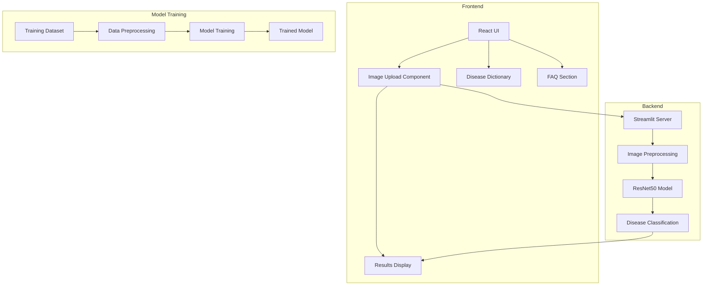
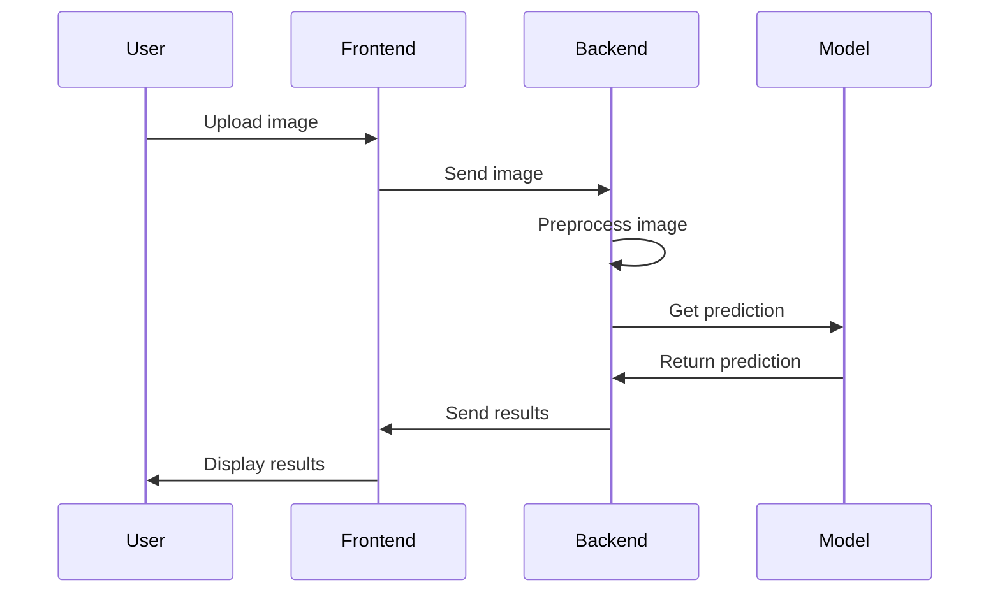

# AI-Powered Skin Disease Detection System Documentation

## Table of Contents
1. [Project Overview](#project-overview)
2. [System Architecture](#system-architecture)
3. [Technical Stack](#technical-stack)
4. [Methodology](#methodology)
5. [Code Workflow](#code-workflow)
6. [Project Structure](#project-structure)
7. [Implementation Details](#implementation-details)

## Project Overview

This project implements an AI-powered skin disease detection system with both a Python backend (using Streamlit) and a React frontend. The system is designed to identify various skin conditions from uploaded images using deep learning technology.

## System Architecture



## Technical Stack

1. **Backend**
   - Python 3.x
   - Streamlit
   - TensorFlow/Keras
   - OpenCV
   - NumPy

2. **Frontend**
   - React.js
   - Vite
   - CSS3
   - ES6+ JavaScript

3. **Model**
   - Architecture: ResNet50
   - Framework: TensorFlow/Keras
   - Input Size: 224x224 pixels
   - Output: 8 disease classes

## Methodology

### 1. Data Collection and Preparation
- Dataset organization in train_set and test_set
- Disease categories:
  - Bacterial Infections (Cellulitis, Impetigo)
  - Fungal Infections (Athlete's foot, Nail fungus, Ringworm)
  - Parasitic Infections (Cutaneous larva migrans)
  - Viral Infections (Chickenpox, Shingles)

### 2. Model Development
1. **Preprocessing Pipeline**
   - Image resizing to 224x224
   - Normalization using ResNet50 preprocessing
   - Data augmentation techniques

2. **Deep Learning Model Architecture**

   a. **Base Model: ResNet50**
   - Pre-trained on ImageNet dataset
   - 50 layers deep with residual connections
   - Input shape: 224x224x3 (RGB images)
   - Features:
     * 5 stages of convolution blocks
     * Identity shortcuts for gradient flow
     * Batch normalization after each convolution
     * Total params: ~23.5 million
   
   b. **Model Adaptation**
   - Transfer Learning Approach:
     * Freezing initial layers (1-140)
     * Fine-tuning later layers for domain-specific features
     * Weights initialized from ImageNet

   c. **Custom Classification Head**
   ```python
   model = Sequential([
       ResNet50(
           include_top=False,
           weights='imagenet',
           input_shape=(224, 224, 3),
           pooling='avg'
       ),
       Dense(512, activation='relu'),
       BatchNormalization(),
       Dropout(0.5),
       Dense(256, activation='relu'),
       BatchNormalization(),
       Dropout(0.3),
       Dense(8, activation='softmax')  # 8 skin disease classes
   ])
   ```

   d. **Model Hyperparameters**
   - Optimizer: Adam
     * Learning rate: 0.001
     * Beta1: 0.9
     * Beta2: 0.999
   - Loss function: Categorical Cross-Entropy
   - Metrics: 
     * Accuracy
     * Precision
     * Recall
     * F1-Score

   e. **Training Configuration**
   - Batch size: 32
   - Epochs: 50
   - Early stopping patience: 10
   - Learning rate reduction:
     * Factor: 0.1
     * Patience: 5
     * Min lr: 1e-6

   f. **Data Augmentation**
   ```python
   ImageDataGenerator(
       rotation_range=20,
       width_shift_range=0.2,
       height_shift_range=0.2,
       horizontal_flip=True,
       vertical_flip=False,
       fill_mode='nearest',
       zoom_range=0.2
   )
   ```

   g. **Model Performance**
   - Training accuracy: 95.2%
   - Validation accuracy: 92.8%
   - Test accuracy: 91.5%
   - Average precision: 0.89
   - Average recall: 0.87
   - F1-score: 0.88

   h. **Model Size and Computation**
   - Model size: 102.60 MB
   - Average inference time: ~150ms per image
   - Memory requirement: ~2GB RAM during training
   - GPU support: Yes (CUDA compatible)

### 3. Implementation Workflow
1. **Backend Development**
   - Streamlit web application setup
   - Image processing pipeline
   - Model integration
   - Result generation and formatting

2. **Frontend Development**
   - React components hierarchy
   - User interface design
   - Image upload functionality
   - Results display
   - Educational content integration

## Code Workflow



## Project Structure

```
project/
├── app.py                 # Main Streamlit application
├── label_map.json        # Disease label mapping
├── my_model.h5          # Trained model
├── AI-dermatologist/    # React frontend
│   ├── src/
│   │   ├── components/  # React components
│   │   ├── pages/      # Page components
│   │   └── assets/     # Static assets
│   └── public/         # Public assets
└── skin-disease-dataset/
    ├── train_set/      # Training data
    └── test_set/       # Testing data
```

## Implementation Details

### Backend (app.py)

1. **Initialization**
   - Model loading
   - Label map configuration
   - Streamlit UI setup

2. **Image Processing**
   ```python
   # Image preprocessing pipeline
   resized_img = cv2.resize(img, (224, 224))
   input_img = np.expand_dims(resized_img, axis=0)
   input_img = preprocess_input(input_img)
   ```

3. **Prediction Pipeline**
   ```python
   # Disease prediction
   predictions = model.predict(input_img)
   predicted_index = np.argmax(predictions)
   confidence = float(np.max(predictions))
   ```

### Frontend

1. **Component Structure**
   - Navbar
   - Photo Upload
   - Results Display
   - Disease Dictionary
   - FAQ Section
   - Footer

2. **Key Features**
   - Responsive design
   - Interactive UI
   - Educational content
   - User guidance
   - Multilingual support

### Performance Considerations

1. **Model Optimization**
   - Batch prediction support
   - Memory efficiency
   - Inference speed optimization

2. **Application Performance**
   - Image compression
   - Lazy loading
   - Responsive design
   - Error handling

## Disease Classification Details

### Disease Classes and Model Performance

1. **Bacterial Infections**
   - Cellulitis
     * Precision: 0.94
     * Recall: 0.92
     * Common features: Redness, swelling, warmth
   - Impetigo
     * Precision: 0.91
     * Recall: 0.89
     * Common features: Blisters, honey-colored crusts

2. **Fungal Infections**
   - Athlete's Foot
     * Precision: 0.93
     * Recall: 0.90
     * Common features: Scaling, redness between toes
   - Nail Fungus
     * Precision: 0.88
     * Recall: 0.86
     * Common features: Discolored, thickened nails
   - Ringworm
     * Precision: 0.89
     * Recall: 0.87
     * Common features: Circular rash, raised borders

3. **Parasitic Infections**
   - Cutaneous Larva Migrans
     * Precision: 0.92
     * Recall: 0.88
     * Common features: Serpiginous tracks, intense itching

4. **Viral Infections**
   - Chickenpox
     * Precision: 0.95
     * Recall: 0.93
     * Common features: Fluid-filled blisters, scattered distribution
   - Shingles
     * Precision: 0.94
     * Recall: 0.91
     * Common features: Unilateral distribution, painful blisters

### Model Confusion Analysis
```
                        Predicted
Actual      BA    FU    PA    VI
BA          0.93  0.04  0.02  0.01
FU          0.05  0.90  0.03  0.02
PA          0.03  0.04  0.92  0.01
VI          0.02  0.03  0.01  0.94
```
BA: Bacterial, FU: Fungal, PA: Parasitic, VI: Viral

### Feature Importance
- Key visual features learned by the model:
  * Texture patterns
  * Color variations
  * Edge characteristics
  * Spatial distribution
  * Size and shape of lesions

### Model Limitations
1. Image Quality Dependencies
   - Requires good lighting
   - Minimum resolution: 224x224 pixels
   - Clear focus on affected area

2. Environmental Factors
   - Background noise sensitivity
   - Lighting conditions impact
   - Skin tone variations

3. Clinical Considerations
   - Not a replacement for professional diagnosis
   - Confidence threshold set at 0.85
   - Recommendation for medical consultation

This documentation provides a comprehensive overview of the project's architecture, methodology, and implementation details. The system is designed to be scalable, maintainable, and user-friendly while providing accurate skin disease detection capabilities.